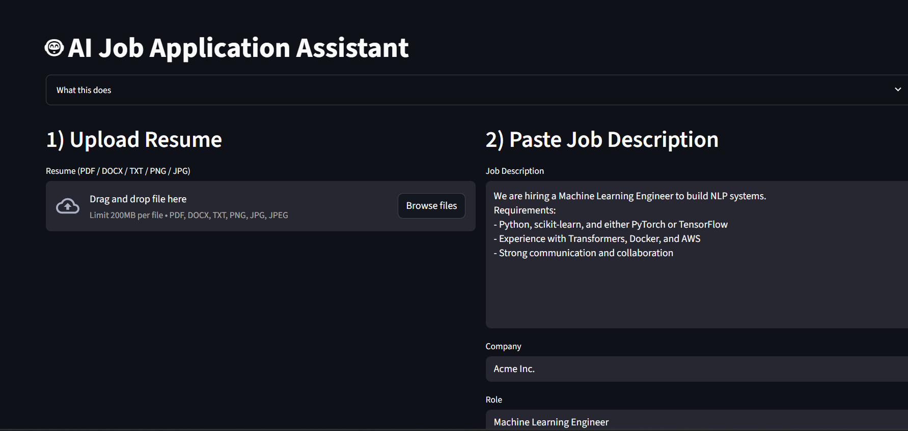

AI Job Application Assistant

An AI-powered tool to help job seekers analyze and tailor their resumes for specific job descriptions. The app compares a resume with a job description, highlights matching skills and experience, and suggests improvements to increase job application success.

Built with Python, Streamlit, SQLite, and AI API (Groq/OpenAI).

🚀 Features

📄 Resume Parsing – Upload a text-based resume (PDF/DOCX) and extract structured information (skills, education, experience).

📝 Job Description Analysis – Paste a job description to identify keywords and requirements.

🤖 AI-Powered Matching – Compare your resume with the job description and get a match score + improvement suggestions.

💾 Save Applications – Store resumes and job descriptions in an SQLite database for tracking.

📊 View Saved Applications – Check past applications and review AI analysis results.

🛠️ Tech Stack

Frontend: Streamlit

Backend: Python

Database: SQLite

AI Processing: Groq API / OpenAI API

File Parsing: PyMuPDF, python-docx

📂 Project Structure
ai-job-assistant/
│
├── main.py               # Streamlit frontend logic
├── db_utils.py           # Database utility functions
├── models.py             # Database schema
├── requirements.txt      # Python dependencies
├── README.md             # Project documentation
└── data/
    └── applications.db   # SQLite database (auto-created)

⚙️ Installation & Setup
1️⃣ Clone the repository
git clone https://github.com/yourusername/ai-job-assistant.git
cd ai-job-assistant

2️⃣ Create a virtual environment
python -m venv venv
source venv/bin/activate      # macOS/Linux
venv\Scripts\activate         # Windows

3️⃣ Install dependencies
pip install -r requirements.txt

4️⃣ Add your API key

Create a .env file in the project root:

GROQ_API_KEY=your_groq_api_key_here

5️⃣ Run the app
streamlit run main.py

📌 Usage

Upload Resume → Upload a PDF/DOCX with text content.

Paste Job Description → Copy a job listing text into the box.

Click Analyze → AI compares your resume with the job description and gives results.

Save to Applications → Store this job & resume in the database.

View Saved Applications → Check all previously saved applications.

📷 Screenshots

(
)

📄 License

This project is licensed under the MIT License – feel free to modify and share!
